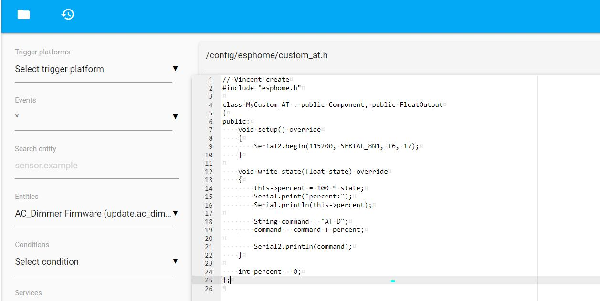
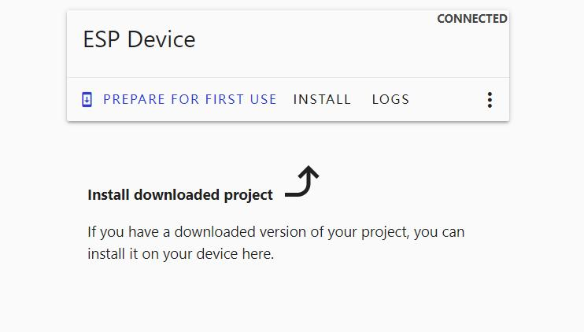

Home Assistant AC Dimmer

```c++
/*
Version:		V1.0
Author:		Vincent
Create Date:	2023/8/24
Note:


*/
```


# Makerfabs

[Makerfabs home page](https://www.makerfabs.com/)

[Makerfabs Wiki](https://wiki.makerfabs.com/)

## Intruduce

[Product Link](https://www.makerfabs.com/ac-dimmer-for-home-assistant.html)

[Wiki Link](https://wiki.makerfabs.com/How_to_use_AC_Dimmer_for_Home_Assistant.html)


## Features

Specs:
- Controller: ESP32
- Dimmer Controller: STM32G030F6
- On-board AC-DC, No external power supply needed;
- On Board Relay to totally shut down current leakage;
- Suitable for AC 110V~230V, Any frequency;
- Max Load: 2KW;


# Equipping Items
Install the Home assistant firmware of Raspberry PI, or other platforms, and ensure that you can log in to the management page.

And install the ESPHome and File editor in the Add-on.

Version of this document:
 
``` c
ESPHome
Current version: 2023.5.1
File editor
Current version: 5.6.0
```


# Equipment Setup

1. Open the HA management page and go to the ESPHome page.


2. Select NEW DEVICE.
3. Select Continue.
4. Set a name, such as AC_Dimmer.


5. Select ESP32.


 
6. Select SKIP, you will return to the ESPHome page, you will see the device you just created.
7. Select EDIT to enter the yaml file editing page


8. Copy the code dimmer.yaml provided by Makerfabs to the end of the file.


9. And at the beginning of the file, friendly_name next to the line, copy:

``` yaml
  includes:
    - custom_at.h
```


10. Pay attention to indentation, there are excess indentation will report errors.
11. Select SAVE, and exit the edit page
12. Go to the File editor page
13. Click the folder icon in the upper left corner
14. Enter “config/esphome/”
15. Create a new file named "custom_at.h".
16. Copy the code my_custom_sensor.h provided by Makerfabs and save it



17. Go back to ESPHome's page, click the three dots in the lower-right corner of the card, and select Install.

18. Select Manual Download, select Modern format, the console page will be displayed, please wait patiently for compilation.


19. After the bin file is downloaded, exit.
20. Open https://web.esphome.io/?dashboard_install, go to the download page


21. Select CONNECT. In the displayed page, select COM port.


22. After the connection is successful, click INSTALL



23. Select the bin file you just downloaded on the pop-up page. Click Install and wait for the installation to complete. If the connection is not successful, hold down the Flash key, then press the Reset key, and then click Download again.
24. download success, click, LOGS pop-up terminal interface, find IP information


25. Go back to the ESPHome page, select EDIT for your device, and go to the YAML edit page.
26. Copy API: encryption key: the back of the content, such as “43 a0nyfb9py7aalga282lgikxkt5i7zhcmu8dhmjnea=”
27. Return to the HA page, select Configuration, and select devices and services
28. If HA automatically identifies the local device, click Configure to add the device automatically. If no, continue to add the device. This is related to the configuration of the HA router.
29. Click on the bottom right corner to add integration, search for ESPHome, and select
30. Enter the IP address you just obtained on the pop-up page, such as 192.168.1.57, and then submit.
31. Enter the key.


32. The device has been added successfully


# HA UI Setup

Normally, HA recognizes this automatically, but if the home page has been manually modified, HA will never add any device display again.

1. Go to the HA home page, click the three dots in the upper right corner, select Edit dashboard


2. The color of the interface changes, select the add card in the lower right corner.
3. In the physical page there are many cards to choose from, here select a dial, click


4. In the dial card configuration page, select the entity, find the relevant content of AC Dimmer


5. Save.
6. The way to add cards is the same as the use of HA, you can arrange the page by yourself.


7. Click Finish to exit editing


